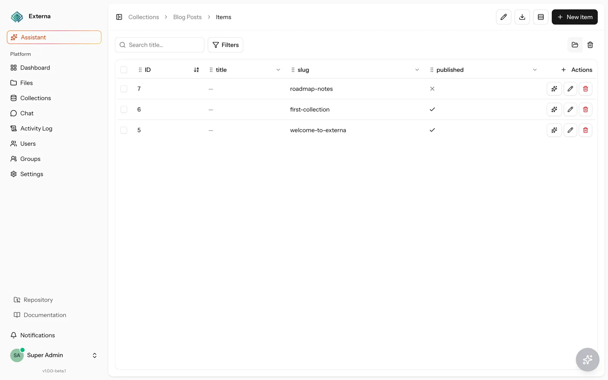
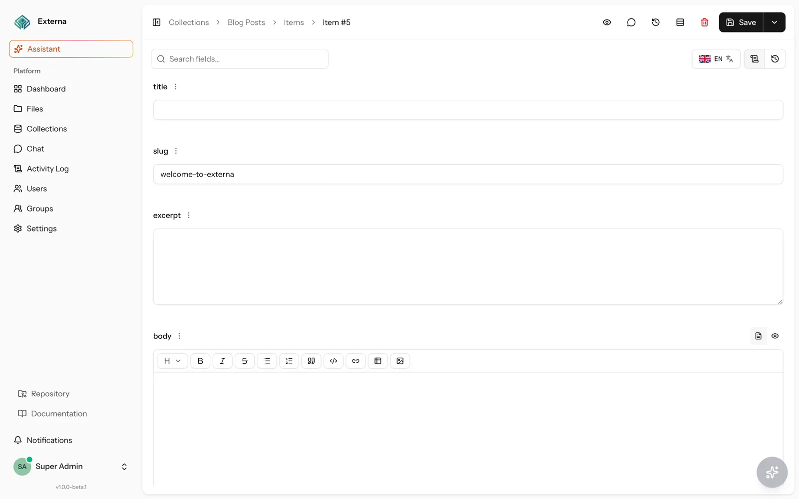
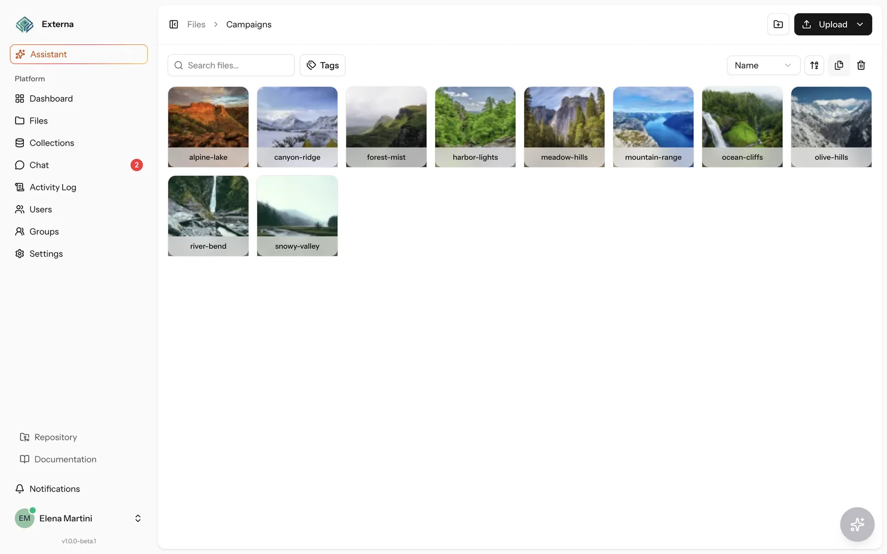
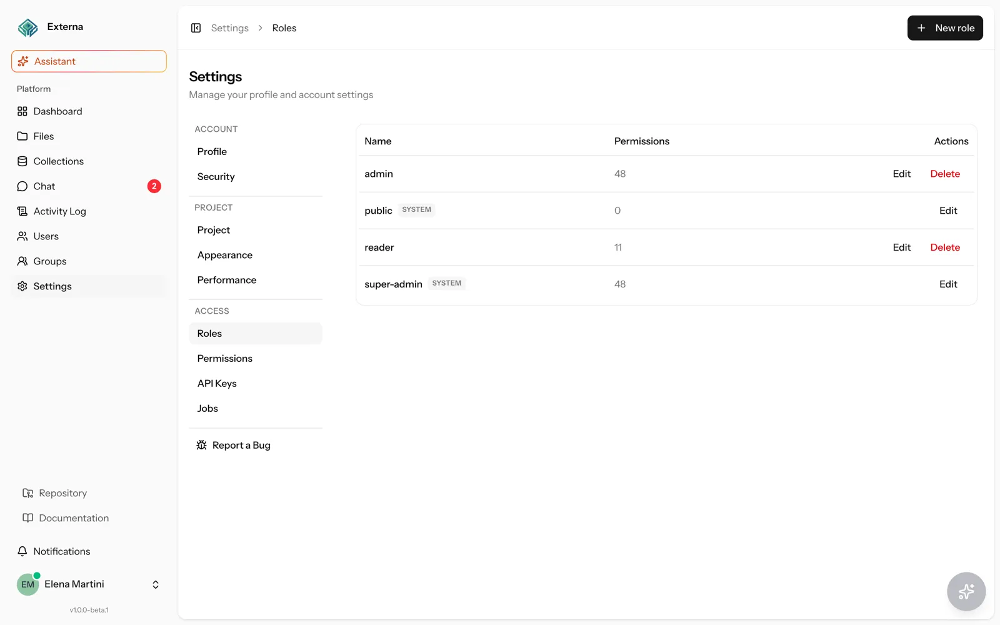
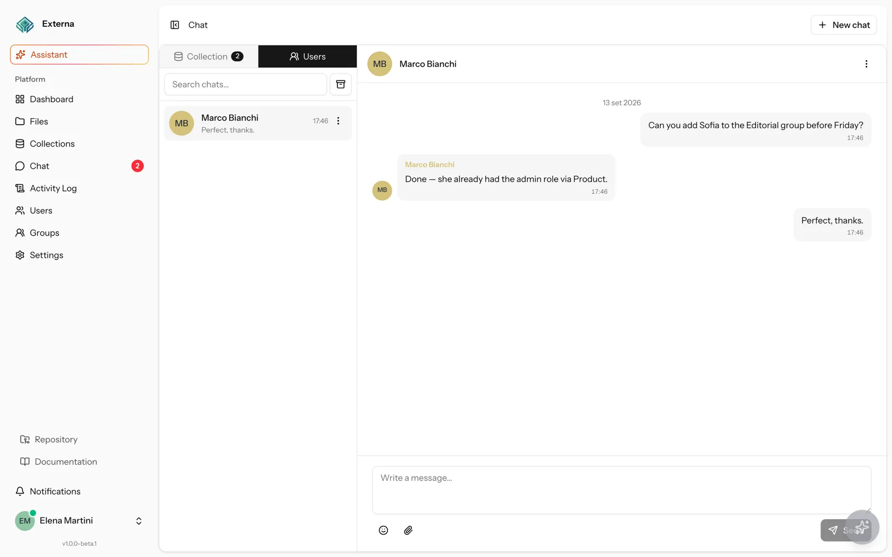
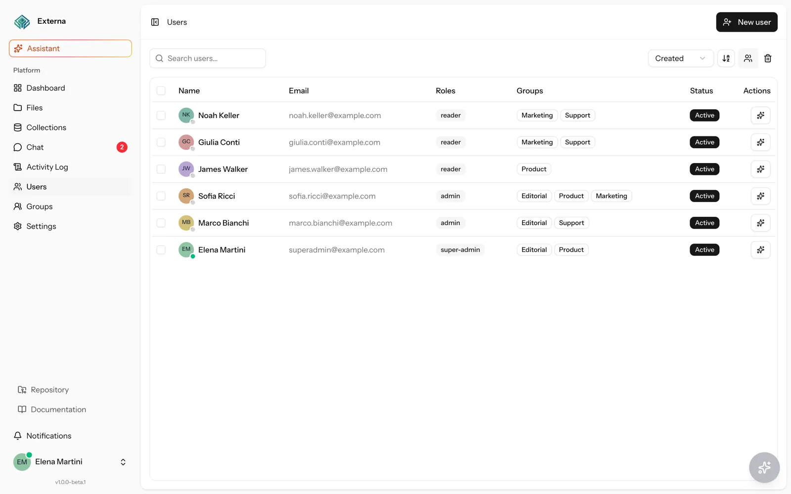

# Externa

[](https://docs.externa.qiick.io)
[](./LICENSE)

**Version:** `1.0.0-beta.2` (from `composer.json`; mirrored in `package.json`). See [CHANGELOG.md](./CHANGELOG.md) and [Releasing docs](https://docs.externa.qiick.io/docs/releasing).

Externa is a **Laravel-native headless CMS**: operators manage structured content in a full admin UI; websites and apps consume it through the **Public CMS API** (`/api/v1`) and **GraphQL** (`/api/graphql`). Optional in-app AI tools respect the signed-in user’s permissions — you own the code, so automation is Jobs/listeners, not a locked Flow canvas.

**Who it is for:** teams that want a self-hosted content API with a serious admin (collections, files, RBAC) on a stack they already know — Laravel 13, Inertia + React 19, Vite.

| | |
| --- | --- |
| **Docs** | [docs.externa.qiick.io](https://docs.externa.qiick.io) |
| **Install** | [Installation](https://docs.externa.qiick.io/docs/installation) · [Minimal vs full stack](https://docs.externa.qiick.io/docs/minimal-vs-full-stack) |
| **API** | [Public CMS API](https://docs.externa.qiick.io/docs/public-cms-api) · [GraphQL](https://docs.externa.qiick.io/docs/graphql) · [1.x compatibility](https://docs.externa.qiick.io/docs/api-compatibility) |
| **Security** | [SECURITY.md](./SECURITY.md) · [Threat model](https://docs.externa.qiick.io/docs/threat-model) |
| **Issues** | [GitHub Issues](https://github.com/qiick-io/externa-core/issues) |

### Highlights

- **Dynamic collections** — fields, locales, lean draft/publish, typed item editor
- **Hierarchical files** — folders, uploads, versions, async zip
- **RBAC + groups** — Spatie roles/permissions with group inheritance; `public` role for the API
- **Public CMS API + GraphQL** — collection access matrix, API keys, origin allowlist; [1.x compatibility policy](https://docs.externa.qiick.io/docs/api-compatibility)
- **Chat + activity** — item/private threads; Spatie activity log
- **Optional AI assistant** — OpenAI-compatible / LM Studio; tools gated by effective permissions

Stack: **Laravel 13**, **Inertia + React 19**, Vite, Spatie Permission / Activitylog, Wayfinder typed routes.

## Product UI

Light-theme shots from the admin (demo seed data). More in the [docs](https://docs.externa.qiick.io).

<p align="center">
  
  <br />
  <em>Collection items — list, filters, and actions</em>
</p>

<p align="center">
  
  <br />
  <em>Item editor — localized fields and rich text</em>
</p>

<p align="center">
  
  <br />
  <em>File manager — folders and assets</em>
</p>

<p align="center">
  
  <br />
  <em>Roles — project access control</em>
</p>

<p align="center">
  
  <br />
  <em>Chat — collection and private threads</em>
</p>

<p align="center">
  
  <br />
  <em>Users — roles, groups, and status</em>
</p>

## Requirements

| Requirement | Notes |
| --- | --- |
| **PHP 8.4+** | Pinned in `.php-version` / `composer.json` (`^8.4`). Herd PHP 8.4 recommended on macOS. |
| **Composer 2** | PHP dependencies and `composer setup` / `composer run dev`. |
| **Node.js 24** | Pinned in `.nvmrc` and `package.json` `engines`. Use `nvm use` (or equivalent). |
| **Database** | **SQLite** 3.x (local/CI default); **PostgreSQL** 14+ (16 preferred, production recommended); **MySQL** 8.0+; **MariaDB** 10.6+ (10.11+ preferred). MySQL/MariaDB: `utf8mb4` / `utf8mb4_unicode_ci`. Matrix: [Supported databases](https://docs.externa.qiick.io/docs/supported-databases). |
| **Redis** (optional) | Needed for Horizon, Reverb-friendly realtime, and Pulse redis ingest. |

Optional: [Laravel Herd](https://herd.laravel.com) (PHP, nginx, `.test` hosts; Pro adds shared Reverb on `:8080`). Optional AI: an OpenAI-compatible gateway (e.g. [LM Studio](https://lmstudio.ai)) at `LOCAL_AI_URL`.

## Quick start

```bash
git clone https://github.com/qiick-io/externa-core.git
cd externa-core
nvm use   # Node 24

cp .env.example .env
# Edit .env: set APP_URL to match how you browse. For no Redis, see “Minimal vs full” below.

touch database/database.sqlite   # if missing (SQLite default)

composer install
php artisan key:generate
php artisan migrate
php artisan db:seed
php artisan storage:link

npm install
php artisan wayfinder:generate --with-form --no-interaction
npm run build   # or skip and rely on `npm run dev` / Vite HMR
```

**Shortcut:** `composer setup` runs install → copy `.env` if missing → `key:generate` → migrate → `npm install` → `npm run build`. Still run `db:seed`, `storage:link`, and Wayfinder (or let Vite generate routes on first `npm run dev`).

### Run locally

**Minimal** (no Redis — set `QUEUE_CONNECTION=database` and `BROADCAST_CONNECTION=log` in `.env`):

```bash
composer run dev
# serve + queue:listen + pail + vite
```

Or with Herd serving the site: keep Vite + a queue worker (`php artisan queue:listen --tries=1 --timeout=0`). For Herd HTTPS (`herd secure`), set `HERD_SITE` to your hostname (e.g. `my-app.test`) so Vite can detect TLS certs.

**Full stack** (Redis + realtime + Pulse — matches `.env.example` defaults):

1. Enable Redis (and Herd Pro Reverb on `:8080` if available).
2. Keep `QUEUE_CONNECTION=redis`, `BROADCAST_CONNECTION=reverb`, and Reverb/Pulse keys from `.env.example`.
3. Start workers (Herd Reverb is already up — do **not** also `reverb:start` on the same port):

```bash
php artisan horizon
php artisan pulse:work
npm run dev
```

Standalone all-in-one (starts its own Reverb — conflicts if Herd already binds `:8080`):

```bash
composer run dev:full
```

Open `APP_URL` (your Herd host, `http://localhost`, or `php artisan serve`). Unauthenticated `/` redirects to login.

### Docker (local full stack)

Official local path is **Compose** (`compose.yaml`) — Sail stays in `require-dev` but is not required. Stack: app (nginx+php-fpm) + Vite + Postgres + Redis + Horizon + Reverb + scheduler + Pulse + Mailpit. Optional MinIO profile for `FILES_DISK=s3`.

```bash
cp .env.docker.example .env
docker compose up --build
# App: http://localhost:8000  (COMPOSE_APP_URL overrides Herd APP_URL inside containers)
# Reverb published on host :8081 (avoids Herd Reverb on :8080)
# MinIO: docker compose --profile minio up --build
# MySQL: docker compose --profile mysql -f compose.yaml -f compose.mysql.yaml up --build
# MariaDB (host :3307): docker compose --profile mariadb -f compose.yaml -f compose.mariadb.yaml up --build
```

Production: multi-stage `Dockerfile` (`--target production`), `compose.prod.yaml`, `.env.docker.prod.example`. Probes: `GET /health/live`, `GET /health/ready` (+ Laravel `/up`). Docs: [Installation](https://docs.externa.qiick.io/docs/installation) · [Deployment](https://docs.externa.qiick.io/docs/deployment).

### First login (local / dev only)

`php artisan db:seed` creates permissions, roles (`super-admin`, `admin`, `reader`, `public`), and a super admin from `config/super_admin.php`:

| | Default |
| --- | --- |
| Email | `superadmin@example.com` |
| Password | `password` |

Override with `INITIAL_SUPER_ADMIN_*` in `.env` **before** seeding. **Local/dev only** — change or remove before any shared or production deploy.

## Important environment variables

Copy from `.env.example` and tune. Full reference: [Environment variables](https://docs.externa.qiick.io/docs/environment-variables).

| Group | Keys (curated) | Notes |
| --- | --- | --- |
| **App** | `APP_NAME`, `APP_ENV`, `APP_KEY`, `APP_DEBUG`, `APP_URL` | `APP_URL` must match how you browse. **HTTP is fine** for password login, TOTP 2FA, and the rest of the CMS. **Passkeys / WebAuthn** need a [secure context](https://developer.mozilla.org/en-US/docs/Web/Security/Secure_Contexts): HTTPS, or `http://localhost` / `http://*.localhost`. Plain `http://*.test` hosts are not secure — browsers hide `PublicKeyCredential`. Local HTTPS: `herd secure <site>`, matching `APP_URL=https://…`, and `HERD_SITE=<site>` for Vite TLS detection. After switching back to HTTP (`herd unsecure`), clear **http + https** cookies for the site or browsers may keep Secure session cookies → **419 Page Expired** on login. Docs: [Passkeys](https://docs.externa.qiick.io/docs/passkeys). |
| **Database** | `DB_CONNECTION` (+ `DB_*` if not SQLite) | Default `sqlite`. Also `pgsql`, `mysql`, `mariadb` — see [Supported databases](https://docs.externa.qiick.io/docs/supported-databases). |
| **Session / cache** | `SESSION_DRIVER`, `CACHE_STORE` | Default `database`. |
| **Queue** | `QUEUE_CONNECTION` | Full: `redis` + Horizon. Minimal: `database` + `queue:listen`. |
| **Redis** | `REDIS_CLIENT`, `REDIS_HOST`, `REDIS_PORT`, `REDIS_PASSWORD` | Required for Horizon / Pulse redis ingest. |
| **Broadcast / Reverb** | `BROADCAST_CONNECTION`, `REVERB_*`, `VITE_REVERB_*` | Full: `reverb`. Minimal: `log` (60s notification poll). Restart Vite after `VITE_REVERB_*` changes. |
| **Pulse** | `PULSE_ENABLED`, `PULSE_INGEST_DRIVER`, `PULSE_*` | Prefer redis ingest + `pulse:work`. Disable with `PULSE_ENABLED=false` when not using Redis. |
| **AI** | `AI_DEFAULT_PROVIDER`, `LOCAL_AI_URL`, `LOCAL_AI_MODEL`, … | Optional; defaults target a local OpenAI-compatible gateway. |
| **Files** | `FILES_DISK`, `FILES_DUPLICATE_SYNC_MAX_BYTES`, `FILES_ZIP_*`, `AWS_*` | File manager disk (`assets` or `s3`). Async zip / large duplicate need a queue worker. Zip archives stay on the shared local `storage` volume. |

See `.env.example` for every key and inline comments.

## Optional services

| Service | When you need it |
| --- | --- |
| **Horizon** | Redis queues, dashboard Health Horizon cards, `/horizon` (super-admin). |
| **Reverb + Echo** | Live admin notifications, presence / avatar connection indicator. Prefer Herd Pro Reverb locally. |
| **Pulse** | Metrics for dashboard **Health**; full UI at `/pulse`. Needs ingest worker when using redis ingest. |
| **Queue worker** | Always needed for zip downloads, large/bulk duplicates, and collection imports — even on the minimal stack. |

Details: [Redis](https://docs.externa.qiick.io/docs/redis-prerequisite) · [Horizon](https://docs.externa.qiick.io/docs/horizon) · [Reverb](https://docs.externa.qiick.io/docs/reverb-and-echo) · [Pulse](https://docs.externa.qiick.io/docs/pulse-and-health) · [Operations](https://docs.externa.qiick.io/docs/operations).

## Tests and quality

Use **Node 24** for frontend checks (`nvm use`).

```bash
composer test          # config:clear + Pint --test + Pest
php artisan test       # Pest only
composer lint          # Pint (fix)
composer lint:check    # Pint --test
composer ci:check      # npm lint/format/types + composer test

npm run lint:check
npm run format:check
npm run types:check
```

Pest browser tests live under `tests/Browser/`. See [Testing](https://docs.externa.qiick.io/docs/testing).

## Related projects

| Project | Role |
| --- | --- |
| [Documentation](https://docs.externa.qiick.io) | Product & ops docs |
| [externa-bruno](https://github.com/qiick-io/externa-bruno) | Runnable Public CMS API + GraphQL requests |
| [GitHub — externa-core](https://github.com/qiick-io/externa-core) | This repository |

## License

MIT — see [LICENSE](./LICENSE).
